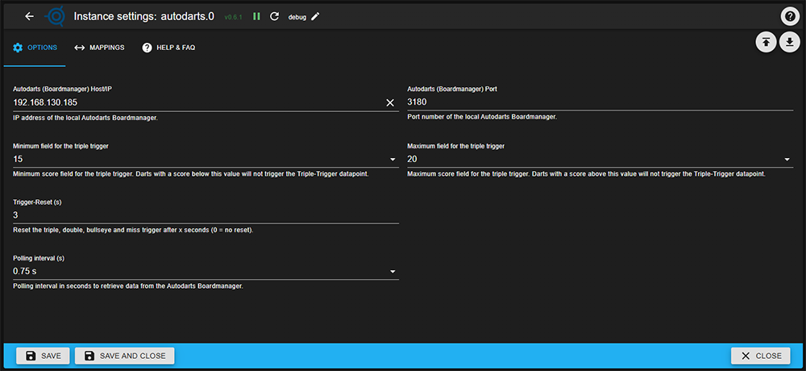

## Adapter for Autodarts Integration

## What this adapter does

Connects to your local Autodarts Board Manager (via IP and port, e.g. `192.168.x.x:3180`) and exposes ioBroker states for home automation:

- Turn on lights when a game starts
- Play a sound on a bullseye
- Announce the next throw via text-to-speech (TTS)
- Control board hardware (lighting, power)
- Trigger any other ioBroker automation based on dart events

## Features

### Game State & Throws
- **`visit.score`**: Total score of the last complete visit (3 darts)
- **`throw.current`**: Numeric score of the last thrown dart
- **`throw.isTriple`**: Boolean flag for triple hits within configurable segment range (default: 1–20)
- **`throw.isBullseye`**: Boolean flag for bullseye hits only

### Board Status
- **`status.trafficLightColor`**: HEX color of current board status
- **`status.trafficLightState`**: Status indicator
  - `green` = Player may throw
  - `yellow` = Remove darts
  - `red` = Board offline/error

### System Information
- **`system.software.*`**: Autodarts versions (boardVersion, desktopVersion), OS and platform details
- **`system.hardware.*`**: CPU model, kernel architecture, hostname
- **`system.cams.cam0/1/2`**: Camera configuration (width, height, fps) as JSON

### Hardware Control
- **`system.hardware.light`**: Control board lighting (bidirectional with external states)
- **`system.hardware.power`**: Control board power (bidirectional with external states)

### Runtime Configuration
- **`config.tripleMinScore/tripleMaxScore`**: Adjust triple trigger thresholds during runtime
- **`config.triggerResetSec`**: Auto-reset time for triple/bullseye flags

## What this adapter does NOT do

- ❌ No data is sent to the internet or to third-party servers
- ❌ No history, statistics, or personal data is stored or shared
- ❌ No access to other people's boards or remote boards over the internet
- ❌ No cloud features or analytics

All data stays local on your ioBroker system.

## Configuration

In the adapter settings, enter:

- **Board Manager IP**: IP address of your Autodarts Board Manager (e.g. `192.168.178.50`)
- **Port**: Usually `3180` (default for Board Manager)
- **Polling interval (s)**: How often to check for new throws (default: 1s)

### Optional: Hardware Control Mapping
- **Light Target ID**: ioBroker state ID to sync with `system.hardware.light` (e.g., `0_userdata.0.LIGHT`)
- **Power Target ID**: ioBroker state ID to sync with `system.hardware.power` (e.g., `0_userdata.0.POWER`)

When configured, changes to either the adapter states or external states are synchronized bidirectionally.

## Privacy & Data Handling

- This adapter only reads data from your **local** Autodarts Board Manager in your own network.
- No personal data is sent to external servers or stored in the cloud.
- All data stays on your own system; no statistics or throw history are collected or shared.
- This adapter is designed to work only with your own dartboard, not with remote or other people’s boards.

## Changelog
<!--
	### **WORK IN PROGRESS**
-->
### **WORK IN PROGRESS**
- (skvarel) Fixed: Hardware light/power mapping now respects configured target IDs and works on all systems.

### 0.5.0 (2025-12-28)
- (skvarel) Added: Bidirectional hardware control states `system.hardware.light` and `system.hardware.power`
- (skvarel) Added: Configuration options to map light/power states to external ioBroker states (e.g., 0_userdata)
- (skvarel) Changed: Hardware states now support read/write operations for full automation integration

### 0.4.0 (2025-12-28)
- (skvarel) Changed: Restructured system information into dedicated `system.hardware`, `system.software` and `system.cams` channels.
- (skvarel) Added: New software info states (`desktopVersion`, `boardVersion`, `platform`, `os`) and hardware info states (`kernelArch`, `cpuModel`, `hostname`).
- (skvarel) Added: Camera configuration states `system.cams.cam0/1/2` containing JSON with width, height and fps.
- (skvarel) Changed: Adapter configuration for polling interval and triple trigger thresholds is now fully driven via jsonConfig (dropdowns and number fields).
- (skvarel) Removed: Experimental light/power alias mapping from internal logic (no user-visible feature was released).

### 0.3.3 (2025-12-27)
- (skvarel) Changed: Configuration fields interval and triggerReset now use seconds instead of milliseconds in the admin UI.

### 0.3.2 (2025-12-27)
- (DrozmotiX) **ENHANCED**: Fixed all TypeScript type errors by adding proper type definitions for config properties
- (DrozmotiX) **ENHANCED**: Refactored HTTP request handling - created reusable httpHelper module to eliminate code duplication
- (DrozmotiX) **ENHANCED**: Converted HTTP callback-based requests to async/await pattern for better error handling
- (DrozmotiX) **ENHANCED**: Improved connection state logging - now logs when connection is restored after being offline
- (DrozmotiX) **ENHANCED**: Standardized async/await usage across all state change handlers for consistency
- (DrozmotiX) **FIXED**: Removed unused error variable in fetchVersion method
- (DrozmotiX) **FIXED**: Added proper error type checking in fetchConfig to prevent runtime errors
- (DrozmotiX) **TESTING**: Added comprehensive unit tests for httpHelper module covering success, timeout, and error scenarios

### 0.3.1 (2025-12-27)
- (skvarel) Changed: Object creation now uses extendObjectAsync with proper roles and types instead of setObjectNotExistsAsync.

### 0.3.0 (2025-12-26)
- (skvarel) Added traffic light datapoints (`status.trafficLightColor`, `status.trafficLightState`) mapped from Board Manager status (`Throw` / `Takeout` / connection errors).
- (skvarel) Refactored code: visit handling, throw handling (triple / bull) and traffic light logic moved to separate modules.

### 0.2.2 (2025-12-25)
- (skvarel) bugfix

### 0.2.1 (2025-12-25)
- (skvarel) Reset for triple and bullseye trigger added

### 0.2.0 (2025-12-25)
- (skvarel) Added datapoint for bulls-hit
- (skvarel) Added maximun triple-hit flag score
- (skvarel) Update config
- (skvarel) Warning in log cleared

### 0.1.0 (2025-12-23)
- (skvarel) Added: Datapoints for visit score, current dart score, triple-hit flag with configurable minimum score
- (skvarel) Added: Camera configuration states (cam0–cam2)
- (skvarel) Changed: Cleaned up adapter logic and internal polling/timing
- (skvarel) Changed: Updated translations

### 0.0.14 - 0.0.2 (2025-12-21 - 2025-12-22)
- (skvarel) Initial release with multiple fixes for adapter checker compliance and documentation improvements

## License
MIT License

Copyright (c) 2025 skvarel <sk@inventwo.com>

Permission is hereby granted, free of charge, to any person obtaining a copy
of this software and associated documentation files (the "Software"), to deal
in the Software without restriction, including without limitation the rights
to use, copy, modify, merge, publish, distribute, sublicense, and/or sell
copies of the Software, and to permit persons to whom the Software is
furnished to do so, subject to the following conditions:

The above copyright notice and this permission notice shall be included in all
copies or substantial portions of the Software.

THE SOFTWARE IS PROVIDED "AS IS", WITHOUT WARRANTY OF ANY KIND, EXPRESS OR
IMPLIED, INCLUDING BUT NOT LIMITED TO THE WARRANTIES OF MERCHANTABILITY,
FITNESS FOR A PARTICULAR PURPOSE AND NONINFRINGEMENT. IN NO EVENT SHALL THE
AUTHORS OR COPYRIGHT HOLDERS BE LIABLE FOR ANY CLAIM, DAMAGES OR OTHER
LIABILITY, WHETHER IN AN ACTION OF CONTRACT, TORT OR OTHERWISE, ARISING FROM,
OUT OF OR IN CONNECTION WITH THE SOFTWARE OR THE USE OR OTHER DEALINGS IN THE
SOFTWARE.