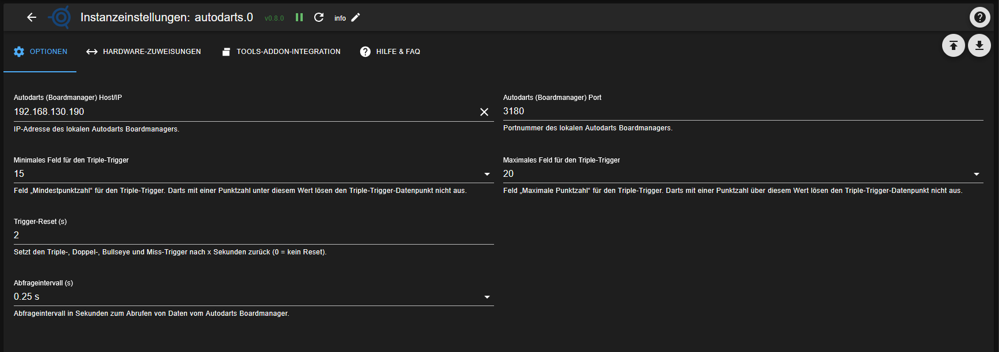

### Adapter for Autodarts Integration
[zurück zur Startseite](README.md)

## OPTIONEN

Der Tab **Optionen** enthält die allgemeinen Verbindungseinstellungen zum Autodarts-Boardmanager sowie ein paar Parameter zur Trigger-Logik.

### Autodarts (Boardmanager) Host/IP

IP-Adresse oder Hostname des lokalen Autodarts-Boardmanagers bzw. Autodarts-Desktop.  
Die Instanz verbindet sich nur dann, wenn hier eine erreichbare Adresse eingetragen ist.

### Autodarts (Boardmanager) Port

TCP-Port des Autodarts-Boardmanagers (Standard: `3180`).  
Nur anpassen, wenn der Boardmanager auf einem anderen Port läuft.

### Minimales Feld für den Triple-Trigger

Kleinste Feldnummer, ab der Triple-Treffer ausgewertet werden (z. B. 15).  
Darts mit einer Punktzahl unterhalb dieses Werts lösen den Triple-Trigger-Datenpunkt nicht aus.

### Maximales Feld für den Triple-Trigger

Größte Feldnummer, bis zu der Triple-Treffer ausgewertet werden (z. B. 20).  
Darts mit einer Punktzahl oberhalb dieses Werts lösen den Triple-Trigger-Datenpunkt nicht aus.

### Trigger-Reset (s)

Anzahl Sekunden, nach denen der Triple-, Doppel-, Bullseye- und Miss-Trigger automatisch wieder auf `false` gesetzt wird.  
Ein Wert von `0` deaktiviert das automatische Zurücksetzen (kein Reset).

### Abfrageintervall (s)

Intervall in Sekunden, in dem der Adapter neue Daten vom Autodarts-Boardmanager abruft.  
Kleinere Werte reagieren schneller, erzeugen aber mehr Last auf Board und ioBroker.