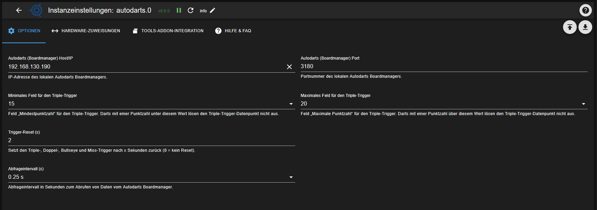

### Adapter for Autodarts Integration
[zurück zur Startseite](README.md)

## OPTIONEN

Der Tab **Optionen** enthält die Verbindungseinstellungen zu Autodarts sowie Parameter zur Trigger-Logik.

### Verbindungsmodus

- **Lokaler Board-Client** — Fragt den Autodarts-Board-Client im LAN ab (`IP:Port`). Für Autodarts-Versionen **vor v2**.
- **Cloud (Autodarts v2)** — Meldet sich bei Autodarts an und empfängt Board-/Match-Events über die Cloud. Nutzen, wenn lokale `:3180` keine Würfe mehr liefert (Autodarts **v2.0+**).

### Autodarts Host/IP (lokaler Modus)

IP-Adresse oder Hostname des lokalen Autodarts-Board-Clients bzw. Desktop-PCs.  
Nur im lokalen Modus relevant.

### Autodarts Port (lokaler Modus)

TCP-Port des Board-Clients (Standard: `3180`).  
Nur anpassen, wenn der Client auf einem anderen Port läuft.

### Autodarts E-Mail / Passwort / Board-ID (Cloud-Modus)

Zugangsdaten deines Autodarts-Kontos und die Board-ID unter **My Boards** auf [play.autodarts.io](https://play.autodarts.io).  
Zwei-Faktor-Authentifizierung bei Problemen mit dem Passwort-Login deaktivieren. Das Passwort wird verschlüsselt in der Adapter-Konfiguration gespeichert.

### Minimales Feld für den Triple-Trigger

Kleinste Feldnummer, ab der Triple-Treffer ausgewertet werden (z. B. 15).  
Darts mit einer Punktzahl unterhalb dieses Werts lösen den Triple-Trigger-Datenpunkt nicht aus.

### Maximales Feld für den Triple-Trigger

Größte Feldnummer, bis zu der Triple-Treffer ausgewertet werden (z. B. 20).  
Darts mit einer Punktzahl oberhalb dieses Werts lösen den Triple-Trigger-Datenpunkt nicht aus.

### Trigger-Reset (s)

Anzahl Sekunden, nach denen der Triple-, Doppel-, Bullseye- und Miss-Trigger automatisch wieder auf `false` gesetzt wird.  
Ein Wert von `0` deaktiviert das automatische Zurücksetzen (kein Reset).

### Abfrageintervall (s)

Intervall in Sekunden, in dem der Adapter neue Daten vom lokalen Board-Client abruft (**nur lokaler Modus**).  
Kleinere Werte reagieren schneller, erzeugen aber mehr Last auf Board und ioBroker.