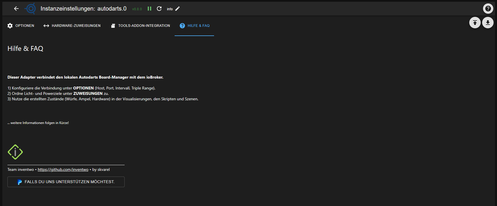

### Adapter for Autodarts Integration
[zurück zur Startseite](README.md)

## HILFE & FAQ

In diesem Tab findest du kurze Antworten auf typische Fragen und Probleme rund um den Adapter.

---

### Die Instanz bleibt gelb

- Prüfe, ob der Autodarts-Boardmanager (oder Autodarts-Desktop) läuft und aus dem ioBroker-Netz erreichbar ist.
- Kontrolliere in den **Optionen**, ob Host/IP und Port korrekt eingetragen sind und kein Tippfehler vorliegt.

---

### Es kommen keine Trigger für „busted / game on / game shot“ an

- Stelle sicher, dass der Simple-API-Adapter installiert, gestartet und im Tab **Tools-Addon-Integration** korrekt konfiguriert ist (IP, Port). 
- Prüfe im Tools-Browser-Addon, ob die generierten URLs aus den `autodarts.0.tools.config.url*`-Objekten exakt in den WLED-Einstellungen hinterlegt sind.

---

### Die Tools-URLs funktionieren im Browser, aber meine Automation reagiert nicht

- Schau im Objektbaum nach, ob sich die Datenpunkte `autodarts.0.tools.busted`, `...gameon`, `...gameshot` beim Test auf `true` setzen.  
- Wenn ja, liegt das Problem in der nachgelagerten Logik (Script, Szene o. Ä.) – dort den entsprechenden Trigger-Datenpunkt als Auslöser hinterlegen.

---

### Wo finde ich Log-Details bei Problemen?

- Setze das Log-Level der Autodarts-Instanz vorübergehend auf **Debug** und wiederhole den Fehler.  
- Die Meldungen findest du in der ioBroker-Admin-Oberfläche unter „Log“, bei Bedarf kann der Log-Auszug im Forum mitgepostet werden.