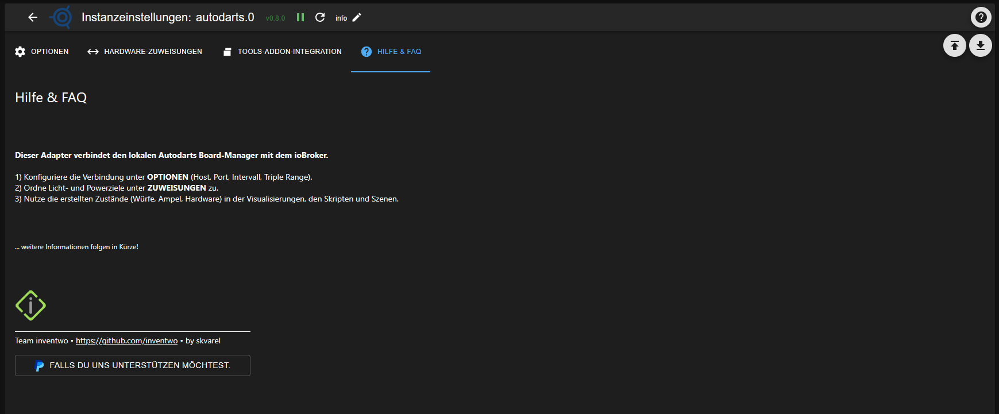

### Adapter for Autodarts Integration
[zurück zur Startseite](README.md)

## HILFE & FAQ

In diesem Tab findest du kurze Antworten auf typische Fragen und Probleme rund um den Adapter.

---

### Die Instanz bleibt gelb

- Prüfe, ob der Autodarts-Boardmanager (oder Autodarts-Desktop) läuft und aus dem ioBroker-Netz erreichbar ist.
- Kontrolliere in den **Optionen**, ob Host/IP und Port korrekt eingetragen sind und kein Tippfehler vorliegt.

---

### Würfe / Trigger bleiben nach Autodarts-Update (v2) leer

Ab Autodarts **v2.0+** ist die Board-Manager-Oberfläche abgeschaltet. Die lokale API auf Port `3180` kann weiterhin Verbindung, Kameras und Board-Status melden, liefert aber **keine Wurfinformationen** mehr (`throws` fehlt / `numThrows` ist `0`).

- Für Autodarts v2 den **Verbindungsmodus** auf **Cloud** stellen und Autodarts-E-Mail, Passwort sowie Board-ID eintragen.
- Der lokale Modus bleibt für Autodarts-Versionen vor v2.
- Allein `info.connection = true` bedeutet nicht, dass Würfe verfügbar sind.

---

### Wo finde ich die Autodarts-Board-ID? (Cloud / v2)

1. [play.autodarts.io](https://play.autodarts.io) öffnen und anmelden.
2. Zu **Boards** / **My Boards** wechseln.
3. Dein Board öffnen (bzw. Board-Details / Einstellungen).
4. Die **Board-ID** kopieren — eine UUID wie `xxxxxxxx-xxxx-xxxx-xxxx-xxxxxxxxxxxx`.
5. In den Adapter-**Optionen** unter **Autodarts-Board-ID** (Cloud-Modus) einfügen.

Es muss dasselbe Autodarts-Konto sein, dem das Board gehört (oder das darauf Zugriff hat). **2FA** am Konto deaktivieren, falls der Passwort-Login fehlschlägt.

---

### Es kommen keine Trigger für „busted / game on / game shot“ an

- Stelle sicher, dass der Simple-API-Adapter installiert, gestartet und im Tab **Tools-Addon-Integration** korrekt konfiguriert ist (IP, Port). 
- Prüfe im Tools-Browser-Addon, ob die generierten URLs aus den `autodarts.0.tools.config.url*`-Objekten exakt in den WLED-Einstellungen hinterlegt sind.

---

### Die Tools-URLs funktionieren im Browser, aber meine Automation reagiert nicht

- Schau im Objektbaum nach, ob sich die Datenpunkte `autodarts.0.trigger.isBusted`, `...isGameon`, `...isGameshot` beim Test auf `true` setzen.  
- Wenn ja, liegt das Problem in der nachgelagerten Logik (Script, Szene o. Ä.) – dort den entsprechenden Trigger-Datenpunkt als Auslöser hinterlegen.

---

### Wo finde ich Log-Details bei Problemen?

- Setze das Log-Level der Autodarts-Instanz vorübergehend auf **Debug** und wiederhole den Fehler.  
- Die Meldungen findest du in der ioBroker-Admin-Oberfläche unter „Log“, bei Bedarf kann der Log-Auszug im Forum mitgepostet werden.