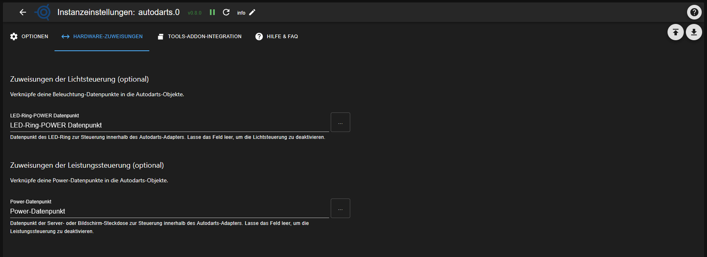

### Adapter for Autodarts Integration
[zurück zur Startseite](README.md)

## HARDWARE-ZUWEISUNGEN

Der Tab **Hardware-Zuweisungen** verknüpft optionale ioBroker-Datenpunkte mit den Autodarts-Objekten, z. B. für Licht- und Leistungssteuerung.

### Zuweisungen der Lichtsteuerung (optional)

Verknüpfe deine Beleuchtungs-Datenpunkte mit den Autodarts-Objekten.  
Lässt du die Felder leer, bleibt die Lichtsteuerung im Adapter vollständig deaktiviert.

#### LED-Ring-POWER Datenpunkt

Datenpunkt, mit dem der LED-Ring am Board über den Autodarts-Adapter geschaltet wird.  
Typischerweise ist dies ein boolescher Datenpunkt (`true` = an, `false` = aus).

### Zuweisungen der Leistungssteuerung (optional)

Verknüpfe deine Power-Datenpunkte (z. B. Steckdosen, Monitor) mit den Autodarts-Objekten.  
Lässt du die Felder leer, bleibt die Leistungssteuerung im Adapter deaktiviert.

#### Power-Datenpunkt

Datenpunkt deiner Steuer- oder Bildschirm-Steckdose, mit dem die Stromversorgung rund um das Dartboard geschaltet wird.  
Auch hier wird in der Regel ein boolescher Schalt-Datenpunkt verwendet.