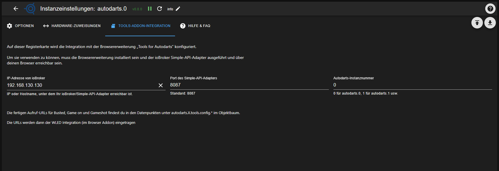
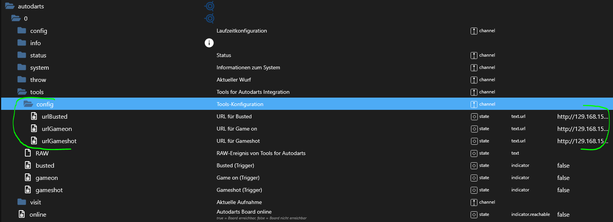
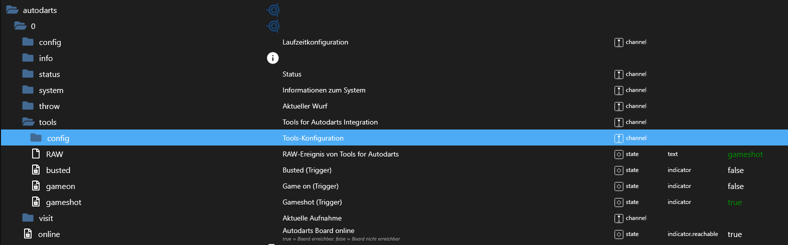

### Adapter for Autodarts Integration
[zurück zur Startseite](README.md)

## Tools-Addon-Integration

Der Tab **Tools-Addon-Integration** verbindet deinen ioBroker mit der Browser-Erweiterung **„Tools for Autodarts“** (getestet mit Chrome und Firefox).

## Voraussetzungen

1. Installierter und laufender Simple-API-Adapter im ioBroker
2. Aktives „Tools for Autodarts“ Browser-Addon im verwendeten Browser

## Tab-Einstellungen

Im Tab **Tools-Addon-Integration** trägst du folgende Informationen ein:

- IP-Adresse deines ioBroker-Systems (auf dem der Simple-API-Adapter installiert ist)  
- Port des Simple-API-Adapters (Standard: 8087)
- Die Autodarts-Instanz, für die die Trigger-Datenpunkte erzeugt werden sollen

Nach dem Speichern erzeugt der Adapter automatisch drei URLs.  
Diese findest du in den Adapter-Objekten unter:

### Beispiel-URLs

- autodarts.0.tools.config.urlBusted: `http://192.168.130.130:8087/set/autodarts.0.tools.RAW?value=busted`  
- autodarts.0.tools.config.urlGameon: `http://192.168.130.130:8087/set/autodarts.0.tools.RAW?value=gameon`  
- autodarts.0.tools.config.urlGameshot: `http://192.168.130.130:8087/set/autodarts.0.tools.RAW?value=gameshot`  

Die URLs folgen dem üblichen Simple-API-Schema `http://<ip>:<port>/set/<stateId>?value=<wert>`.

## Konfiguration im Tools-Addon (WLED)

Diese URLs werden im Tools-Addon in den **WLED-Einstellungen** hinterlegt  
(*Autodarts Tools → Sounds & Animations → WLED*).

Über das Stift-Symbol kannst du die Einträge bearbeiten und die jeweils passende URL eintragen:

Eventuelle Warnungen des Addons zur URL können ignoriert werden, solange der Aufruf korrekt ist.

## Verwendung der Trigger in ioBroker

Sobald die URLs hinterlegt sind, sendet das Addon bei den entsprechenden Spielereignissen („busted“, „game on“, „game shot“) einen HTTP-Request an deinen ioBroker.

Der Adapter setzt daraufhin den passenden Trigger-Datenpunkt (z. B. `autodarts.0.tools.busted`, `...gameon`, `...gameshot`) kurzzeitig auf `true`:

Diese Trigger-Datenpunkte kannst du anschließend in Scripten, Szenen oder anderen Adaptern als Auslöser für weitere **Automationen** verwenden (z. B. WLED-Effekte, Raumbeleuchtung, Sounds).
