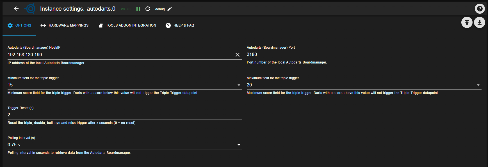

### Adapter for Autodarts Integration
[back to start page](README.md)

## Options

The **Options** tab contains the general connection settings for the Autodarts Boardmanager as well as a few parameters for the trigger logic.

### Autodarts (Boardmanager) host/IP

IP address or hostname of the local Autodarts Boardmanager or Autodarts Desktop.  
The instance will only connect if a reachable address is entered here.

### Autodarts (Boardmanager) port

TCP port of the Autodarts Boardmanager (default: `3180`).  
Change this only if the Boardmanager is running on a different port.

### Minimum field for triple trigger

Smallest field number from which triple hits are evaluated (e.g. 15).  
Darts with a score below this value do not activate the triple trigger data point.

### Maximum field for triple trigger

Largest field number up to which triple hits are evaluated (e.g. 20).  
Darts with a score above this value do not activate the triple trigger data point.

### Trigger reset (s)

Number of seconds after which the triple, double, bullseye and miss triggers are automatically reset to `false`.  
A value of `0` disables the automatic reset (no reset).

### Polling interval (s)

Interval in seconds at which the adapter fetches new data from the Autodarts Boardmanager.  
Smaller values react faster but create more load on both the board and ioBroker.
