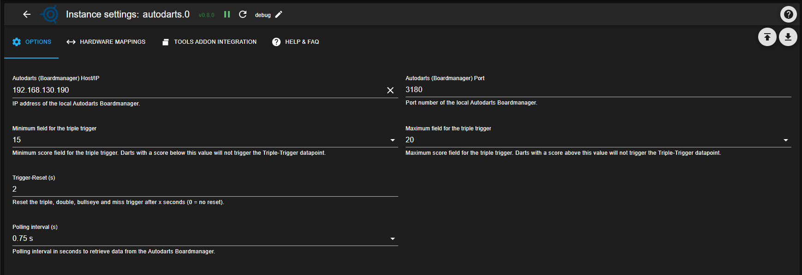

### Adapter for Autodarts Integration
[back to start page](README.md)

## Options

The **Options** tab contains the connection settings for Autodarts as well as a few parameters for the trigger logic.

### Connection mode

- **Local board client** — Polls the Autodarts board client on your LAN (`IP:port`). Use this for Autodarts versions **before v2**.
- **Cloud (Autodarts v2)** — Logs in to Autodarts and receives board/match events over the cloud message bus. Use this when local `:3180` no longer provides throws (Autodarts **v2.0+**).

### Autodarts host/IP (local mode)

IP address or hostname of the local Autodarts board client or Desktop PC.  
Only used in local mode.

### Autodarts port (local mode)

TCP port of the board client (default: `3180`).  
Change this only if the client runs on a different port.

### Autodarts email / password / board ID (cloud mode)

Your Autodarts account credentials and the board ID from **My Boards** on [play.autodarts.io](https://play.autodarts.io).  
Disable two-factor authentication if password login fails. The password is stored encrypted in the adapter config.

**How to find the board ID**

1. Sign in at [play.autodarts.io](https://play.autodarts.io).
2. Open **Boards** / **My Boards**.
3. Open your board and copy the **Board ID** (UUID, e.g. `a1b2c3d4-e5f6-7890-abcd-ef1234567890`).
4. Paste it into **Autodarts board ID** in the adapter options.

See also the [FAQ](faq.md#where-do-i-find-the-autodarts-board-id-cloud--v2).

### Minimum field for triple trigger

Smallest field number from which triple hits are evaluated (e.g. 15).  
Darts with a score below this value do not activate the triple trigger data point.

### Maximum field for triple trigger

Largest field number up to which triple hits are evaluated (e.g. 20).  
Darts with a score above this value do not activate the triple trigger data point.

### Trigger reset (s)

Number of seconds after which the triple, double, bullseye and miss triggers are automatically reset to `false`.  
A value of `0` disables the automatic reset (no reset).

### Polling interval (s)

Interval in seconds at which the adapter fetches new data from the local board client (**local mode only**).  
Smaller values react faster but create more load on both the board and ioBroker.
