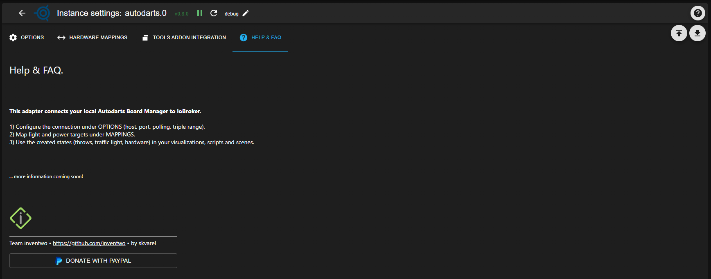

### Adapter for Autodarts Integration
[back to start page](README.md)

## Help & FAQ

This tab provides short answers to common questions and issues related to the adapter.

---

### The instance stays yellow

- Check whether the Autodarts Boardmanager (or Autodarts Desktop) is running and reachable from your ioBroker network.  
- In the **Options** tab, verify that host/IP and port are entered correctly and contain no typos.

---

### No triggers for “busted / game on / game shot”

- Make sure the Simple-API adapter is installed, running and correctly configured in the **Tools addon integration** tab (IP, port).  
- In the Tools browser addon, check that the generated URLs from the `autodarts.0.tools.config.url*` objects are copied exactly into the WLED settings.

---

### Tools URLs work in the browser, but my automation does nothing

- In the object tree, check whether the data points `autodarts.0.tools.busted`, `...gameon`, `...gameshot` are set to `true` when you test the URLs.  
- If they are, the issue is in your downstream logic (script, scene, etc.) – make sure the corresponding trigger data point is used as the trigger there.

---

### Where can I find log details if something goes wrong?

- Temporarily set the log level of the Autodarts instance to **Debug** and reproduce the issue.  
- You can then inspect the messages in the ioBroker admin interface under “Log”; if needed, include a log excerpt when posting in the forum for support.
