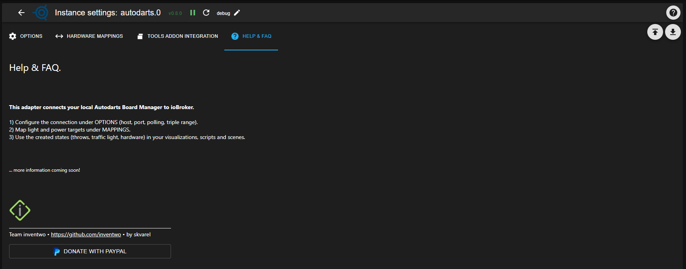

### Adapter for Autodarts Integration
[back to start page](README.md)

## Help & FAQ

This tab provides short answers to common questions and issues related to the adapter.

---

### The instance stays yellow

- Check whether the Autodarts Boardmanager (or Autodarts Desktop) is running and reachable from your ioBroker network.  
- In the **Options** tab, verify that host/IP and port are entered correctly and contain no typos.

---

### Throws / triggers stay empty after an Autodarts update (v2)

Autodarts **v2.0+** deprecates the Board Manager UI. The local API on port `3180` may still report connection, cameras and board status, but **no longer includes throw data** (`throws` stays empty / `numThrows` is `0`).

- For Autodarts v2, set **Connection mode** to **cloud** and enter your Autodarts email, password and board ID.
- Local mode remains for Autodarts versions before v2.
- `info.connection = true` alone does not mean throws are available.

---

### Where do I find the Autodarts board ID? (cloud / v2)

1. Open [play.autodarts.io](https://play.autodarts.io) and sign in.
2. Go to **Boards** / **My Boards**.
3. Open your board (or the board details / settings).
4. Copy the **Board ID** — a UUID like `xxxxxxxx-xxxx-xxxx-xxxx-xxxxxxxxxxxx`.
5. Paste it into the adapter **Options** → **Autodarts board ID** (cloud mode).

You need the same Autodarts account that owns (or can use) that board. Disable **2FA** on the account if password login fails.

---

### No triggers for “busted / game on / game shot”

- Make sure the Simple-API adapter is installed, running and correctly configured in the **Tools addon integration** tab (IP, port).  
- In the Tools browser addon, check that the generated URLs from the `autodarts.0.tools.config.url*` objects are copied exactly into the WLED settings.

---

### Tools URLs work in the browser, but my automation does nothing

- In the object tree, check whether the data points `autodarts.0.trigger.isBusted`, `...isGameon`, `...isGameshot` are set to `true` when you test the URLs.  
- If they are, the issue is in your downstream logic (script, scene, etc.) – make sure the corresponding trigger data point is used as the trigger there.

---

### Where can I find log details if something goes wrong?

- Temporarily set the log level of the Autodarts instance to **Debug** and reproduce the issue.  
- You can then inspect the messages in the ioBroker admin interface under “Log”; if needed, include a log excerpt when posting in the forum for support.
