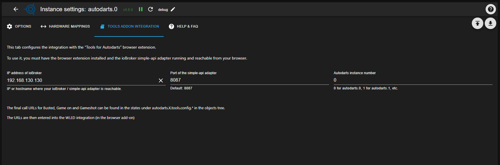
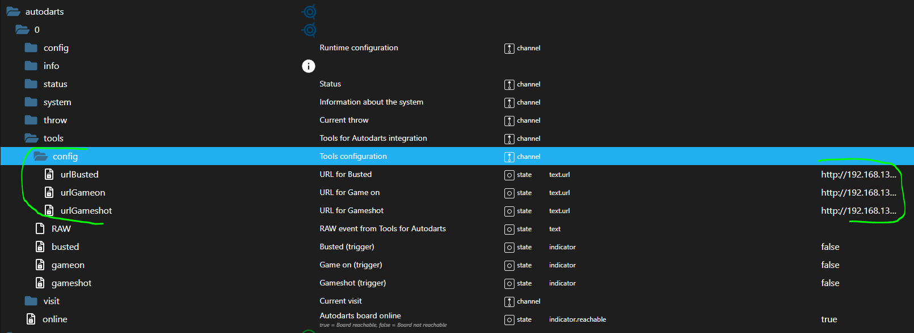
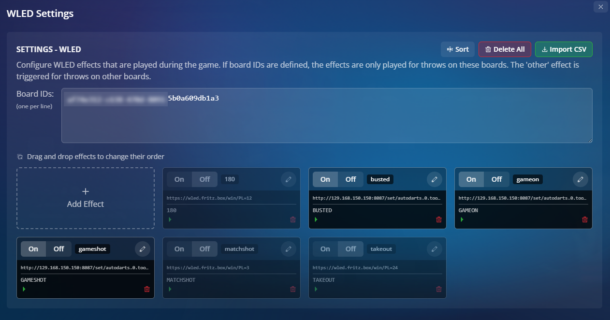
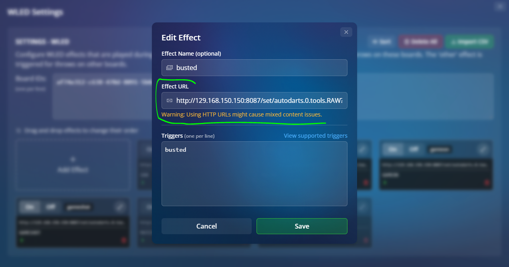

### Adapter for Autodarts Integration
[back to start page](README.md)

## Tools addon integration

The **Tools addon integration** tab connects your ioBroker system with the **“Tools for Autodarts”** browser extension (tested with Chrome and Firefox).

## Requirements

1. Installed and running Simple-API adapter in ioBroker  
2. Active “Tools for Autodarts” browser addon in the browser you use for Autodarts

## Tab settings

In the **Tools addon integration** tab you enter the following information:

- IP address of your ioBroker host (where the Simple-API adapter is installed)  
- Port of the Simple-API adapter (default: 8087)  
- The Autodarts instance for which the trigger data points should be created

After saving, the adapter automatically generates three URLs.  
You can find them in the adapter objects under:

### Example URLs

- `autodarts.0.tools.config.urlBusted`:  
  `http://192.168.130.130:8087/set/autodarts.0.tools.RAW?value=busted`  
- `autodarts.0.tools.config.urlGameon`:  
  `http://192.168.130.130:8087/set/autodarts.0.tools.RAW?value=gameon`  
- `autodarts.0.tools.config.urlGameshot`:  
  `http://192.168.130.130:8087/set/autodarts.0.tools.RAW?value=gameshot`  

The URLs follow the usual Simple-API pattern `http://<ip>:<port>/set/<stateId>?value=<value>`.

## Configuration in the Tools addon (WLED)

These URLs are entered in the **WLED settings** of the Tools addon  
(*Autodarts Tools → Sounds & Animations → WLED*).

Use the pencil icon to edit an entry and paste the corresponding URL:

Any warnings shown by the addon for these URLs can be ignored as long as the call itself is correct.

## Using the triggers in ioBroker

Once the URLs are configured, the addon sends an HTTP request to your ioBroker instance for the corresponding game events (“busted”, “game on”, “game shot”).  

The adapter then briefly sets the matching trigger data point (for example `autodarts.0.tools.busted`, `...gameon`, `...gameshot`) to `true`:

You can use these trigger data points as starting points for further **automations** in scripts, scenes or other adapters (e.g. WLED effects, room lighting, sounds).
